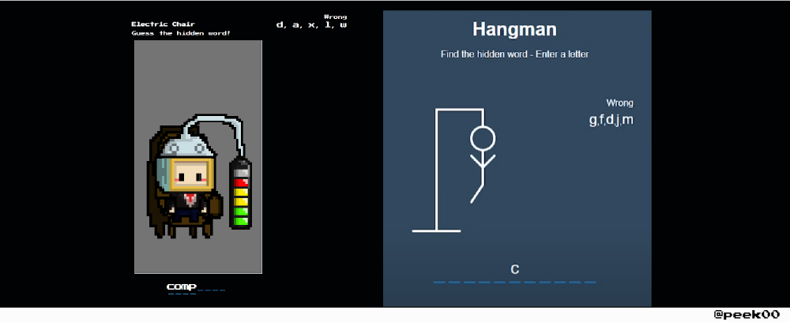
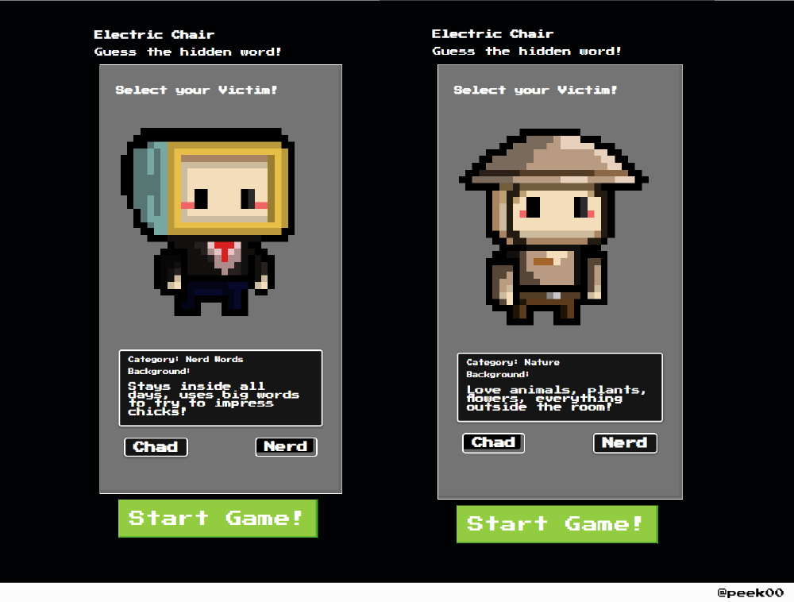
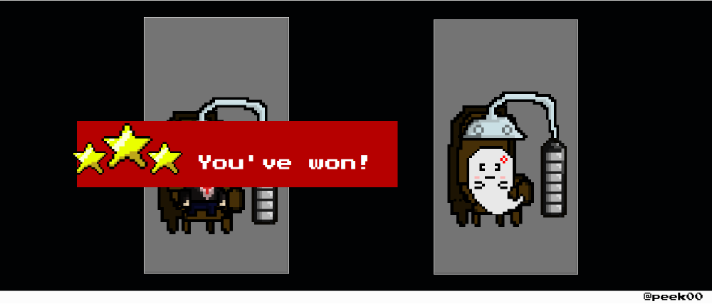
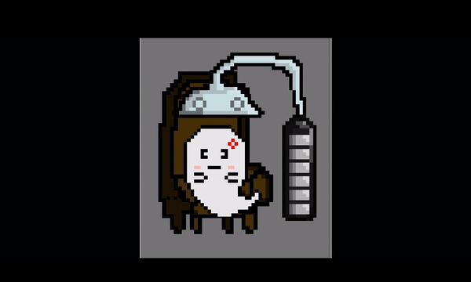
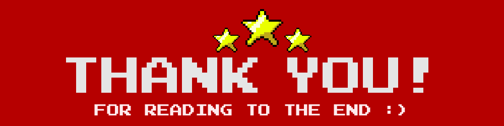

# Electric Chairman - Hangman Inspired Game

**Electric Chairman** is a visually unique take on the classic hangman game. This was created during ByteDance's Youth Camp 2022 and served as my first introduction to `Javascript` and `ReactJS`. 

I initially created the game with `HTML`, `CSS` and vanilla `Javascript` before having to convert over to using `ReactJS` framework at the last minute. The sprites were created with the help of [Piskel](https://www.piskelapp.com/).

___

## Inspiration

The prompt for this camp was relatively simple - to create a Hangman game using a JS framework. After following a [tutorial](https://www.youtube.com/watch?v=fsK9pydvDvY&t=2029s&ab_channel=NinjasHub) on making a classic hangman game, I started thinking of ways I could make it more interesting while keeping the core concept of the game the same.

I wanted to visually represent the game in a different way. The classic hangman game and design made it hard to design a character that looked nice while being able to clearly represent the state of the game. 

My solution was to use an **electric chair** that triggers when the battery is visually full, causing the game to end. This allowed me to design a character that would not have parts magically appear while clearing representing how close the player was to death.

## Character Selection

Now that the character design could be fully appreciated, it led to the idea of a **character selection** screen for my game. I had the idea of linking the type of character selected to the genre the word provided would be. I managed to create two characters during the camp. 

___

## Review

I initally misread the requirements of the submission and built the app fully in vanilla `Javascript` and had to rush to convert it to a `ReactJS` project on the last day. This included learning the framework and figuring out how to integrate what I had already created. As such, there were some gameplay bugs that resulted due to impromper state management in `ReactJS`. 

Through this project, I made extensively use of `useState()`. I experimented with using `useContext()` and `useEffect()` but in the timeframe I had, I was unable to make good use of them and ended up reverting to using `useState()`. 

As I had not planned out the state management before hand, there were instances where I had to pass the same state multiple times from a child component to a parent component and back to another child component. This resulted in some mechanics not working as expected. 

> Pressing play again after dying would not refresh the chosen word and incorrect words entered the previous session would still show up. 

___

## Future Plans

I hope to be able to implement the following:
- More characters to select from.
- EXP mechanic where the more a character is played, the harder the chosen words become.
- Local leaderboard (DB integration).
- In game audio and SFX.
- Deploy.

as well as fixing the state management in the future.

Overall, this project taught me a lot of things about creating a ReactJS application as well as using sprite and spritesheets inside a web application!

